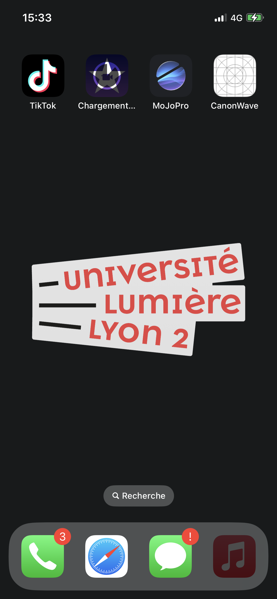
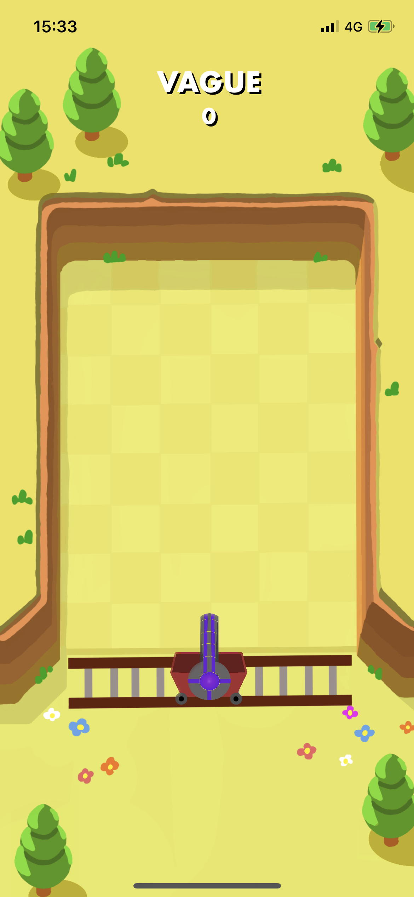

 # **Projet  -  Programmation Mobile**

Master 1 Informatique,
*Université Lumière Lyon 2*

MACHECOURT-BOURGEOIS Renaud

REDJEM Reyane

# Introduction

Le but de notre projet était de créer une application de jeu pour iOS,
inspirée du jeu Punball. Punball est un jeu de type casse-brique dans
lequel les ennemis avancent vers le joueur à chaque tour, et retirent
des points de vie au joueur s’ils sont trop proches, le joueur quant à
lui ne peut que viser et tirer, mais à chaque tour, il se déplace à
l’endroit où les balles ont fini leur course. Le joueur doit donc
détruire tous les ennemis avant qu’ils n’atteignent sa position. Notre
objectif était de reproduire ce jeu en y recréant ses fonctionnalités
telles que le lancement de plusieurs balles, les rebonds, l’apparition
d’ennemis et leur avancée, ainsi que la barre de vie. Dans ce rapport,
nous allons présenter notre projet, y compris les difficultés que nous
avons rencontrées et les solutions que nous avons trouvées. Nous
expliquerons également comment nous avons réparti les tâches entre les
membres de l’équipe et les sources que nous avons utilisées pour nous
aider dans notre développement. Enfin, nous présenterons les
perspectives d’amélioration si nous avions eu plus de temps. Nous
espérons que ce rapport vous donnera une bonne compréhension de notre
projet et de notre approche de développement.

# Difficultés rencontrées

Au cours du développement de notre projet, nous avons rencontré
plusieurs difficultés qui ont nécessité des efforts supplémentaires pour
être résolues. Tout d’abord, nous avons eu du mal à gérer la rotation du
joueur par rapport au doigt. En effet, la rotation ne s’effectuait pas
sur le bon axe à cause d’un problème de dimension dans l’image utilisée.
Nous avons dû ajuster les dimensions du fichier utilisé pour que la
rotation s’effectue correctement. Ensuite, nous avons rencontré des
difficultés pour implémenter le système de multi-balles. Au départ, nous
avions prévu de créer plusieurs objets balle, mais cela rendait le tout
trop compliqué. Nous avons donc décidé de lancer plusieurs fois la même
balle, en utilisant une variable "BalleRestante" et les lancer dans la
même direction que la première. Une autre difficulté a été la gestion
des collisions entre la balle et les ennemis. Nous avons dû ajuster la
taille des ennemis et de la balle pour que les collisions soient
détectées correctement. Nous avons également dû ajouter des effets
sonores pour indiquer au joueur qu’une collision avait eu lieu. Enfin,
nous avons rencontré des difficultés pour gérer les points de vie. Nous
avons dû ajuster la difficulté du jeu pour que le joueur et les ennemis
ne perdent pas trop rapidement leurs points de vie, tout en veillant à
ce que le jeu reste suffisamment difficile pour être intéressant. Dans
l’ensemble, ces difficultés nous ont permis d’apprendre beaucoup de
choses sur le développement de jeux pour iOS, et nous avons pu trouver
des solutions efficaces pour les résoudre.

# Partage des tâches

Notre équipe était composée de deux membres, Renaud et Reyane. Nous
avons divisé les tâches de manière à ce que chacun puisse travailler sur
des aspects différents du projet, en fonction de ses compétences et de
ses intérêts. Renaud a été responsable de la programmation des rebonds
de la balle et de son déplacement, ainsi que de l’apparition des ennemis
et de leur avancée. Il a également travaillé sur la gestion des
collisions entre la balle et les ennemis, ainsi que sur la gestion de la
barre de vie du joueur. Reyane a été responsable de la programmation de
la visée par le joueur, de son déplacement et du système de
multi-balles. Il a également créé les images utilisées dans le jeu,
telles que le fond, le joueur, les ennemis, etc. Nous avons travaillé en
étroite collaboration tout au long du projet, en communiquant
régulièrement pour nous assurer que nos parties respectives du code
fonctionnaient bien ensemble. Lorsque l’un de nous rencontrait un bug ou
avait des difficultés à implémenter une fonctionnalité, nous nous
aidions mutuellement pour trouver une solution. Nous avons également
utilisé GitHub pour gérer notre code source et collaborer efficacement.
En divisant les tâches de cette manière, nous avons pu tirer parti des
compétences et des intérêts de chacun, tout en nous assurant que toutes
les fonctionnalités du jeu étaient développées de manière cohérente et
efficace. Nous sommes fiers du travail que nous avons accompli ensemble
et nous pensons que notre approche de collaboration a contribué au
succès de notre projet.

# Source externe

Notre jeu est une reproduction du jeu Punball. Nous avons reproduit le
concept de jeu, les fonctionnalités et les images du jeu original pour
créer notre propre version. Ensuite, nous avons utilisé la documentation
Apple et Stack Overflow pour résoudre les problèmes que nous avons
rencontrés lors du développement. Nous avons trouvé de nombreux
tutoriels et exemples de code utiles sur ces sites, qui nous ont aidés à
comprendre comment implémenter certaines fonctionnalités.

# Utilisation de l’IA

Bien que nous n’ayons pas utilisé l’IA pour générer du code, nous
l’avons utilisé pour résoudre certains problèmes algorithmiques que nous
avons rencontrés lors du développement. Principalement les algorithmes
mathématiques liés à la direction que la balle doit prendre après avoir
visé

# Tests

Nous avons testé notre jeu sur le simulateur de Xcode ainsi que sur un
iPhone physique pour nous assurer qu’il fonctionnait correctement et
qu’il n’y avait pas de bugs ou de problèmes de performance. Tout
d’abord, tout au long du projet, nous avons testé le jeu sur le
simulateur de Xcode pour vérifier que toutes les fonctionnalités
fonctionnaient correctement et que le jeu était jouable. Nous nous
sommes concentrés sur une seule taille d’écran (l’iPhone 14 Pro) et
avons bloqué la rotation de l’écran au mode portrait uniquement afin de
pouvoir nous concentrer sur les fonctionnalités du jeu et évité
d’éventuels problèmes. Ensuite, nous avons testé le jeu sur un iPhone
physique pour nous assurer qu’il fonctionnait correctement sur un
appareil réel. Aucun changement de comportement n’a été observé, mais il
faut prendre en compte que la version testée n’était pas la version
finale.

    
    

# Perspectives d’amélioration

Bien que nous soyons fiers de notre jeu et de ce que nous avons
accompli, il y a toujours place à l’amélioration. Voici quelques
perspectives d’améliorations que nous avons identifiées :

-   Ajouter des niveaux supplémentaires: actuellement, notre jeu ne
    comporte qu’un seul niveau. Nous pourrions ajouter des niveaux
    supplémentaires dans lequel la difficulté et les ennemis serait
    différent plutôt que le système de vagues infini actuel.

-   Ajouter des power-ups: nous pourrions ajouter des power-ups, tels
    que des balles immobilisantes ou des balles incendiaires, pour aider
    les joueurs à détruire les ennemis plus rapidement et plus
    efficacement.

-   Améliorer les graphismes: bien que nous ayons reproduit les
    graphismes de Punball, nous pourrions améliorer les graphismes pour
    créer un style visuel unique et attrayant.

-   Ajouter des sons et de la musique: actuellement, notre jeu ne
    comporte pas de sons ou de musique. Nous pourrions ajouter des
    effets sonores et de la musique pour améliorer l’expérience de jeu.

-   Ajouter un menu pause: nous pourrions ajouter un menu permettant de
    mettre pause au jeu, de voir les statistiques de la partie et les
    améliorations obtenues

